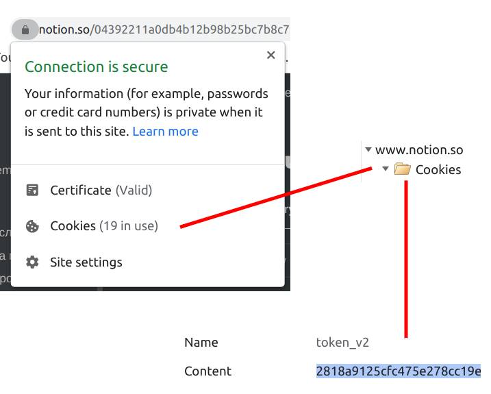

# CLI for SRS in Notion


### What is Spaced Repetition System?

This video is crucial for understanding what is going on next:

[](https://youtu.be/YcD92j_pDNY)

SRS is a system that helps you to remember any foreign words/concepts/etc by making you trying to remember the right answer from time to time. The feature is that the interval of asking grows **exponentially** if you answer correctly, which guarantees the fact that you won't answer the same word more than 9 times in 2 years (if you never forget the answer to this question), so you can learn a lot of words efficiently. 

## Why would someone need CLI of SRS, if the SRS is already implemented in a Notion template?

Notion's performance is a fairly well-known problem. Dealing with plenty of words a day may cause a significant loss of time, while CLI can provide peak efficiency.  Also, in Notion you need to increment the level manually, which takes time. 

This tool is very useful for me personally. 

## Usage

Just run and answer today's cards:

```
=>  envisage  <=


Flip the card? 
```

(here you're trying to remember what does this word mean, then you press any key)

```
=>  envisage  <=


Flip the card? 

предусматривать, подразумевать
[ɪnˈvɪzɪʤ]

(a = accept, d = decline, smth else = skip): a
accepted.
```

Then the next card will appear.

## How to run

1. ~~`pip3 install notion`~~ `pip3 install git+https://github.com/jamalex/notion-py.git@refs/pull/294/merge` (for the moment of writing this doc, it's the way to use notion API with getting an 400 error **less frequently**)
2. Configure the tool (see "Configuring")
3. Run by `./notion-srs.py `

## Configuring

*Note: if you're using Windows, you should type `python3 file.py ` in command line instead of `./file.py`*

1. Open `config.py` file in a text editor

2. Go to [notion.so](https://notion.so) in your browser and copy the `v2` cookie into the second line of `config.py` instead of `paste here`  (do not delete the quotes)

   

3. Click on `"..."` -> `"Open as page"` at cards gallery, then get a link to the "today's view" (a view that shows cards for today) by `"..."` -> `"Copy link"` and past the link into the 5th line of `config.py`

4. Save the `config.py` and run `get_props.py` by typing `./get_props.py`. You'll get column names list (if not an error, which I have nothing to do with) . Place them appropriately in `config.py` variables (between the quotation marks) like this:

   ```python
   translation = 'perevod'
   transcription = 'kak_chitaetsia'
   level = 'level'
   date_wrong = 'date_wrong'
   ```

5. Done! Now you can run the main script.

## Possible errors

1. The **400** HTTP error (when trying to get cards info by `get_collection_view`)

   This error occurs as a result of the requests of the `notion-api` package to Notion. It is a well-known issue and I have nothing to do with it, so I just try to avoid running my script more than I need it to complete each day's cards.

2. ```requests.exceptions.HTTPError: 401 Client Error: Unauthorized for url: https://www.notion.so/api/v3/loadUserContent```

   This error is raised if you somehow copied incorrectly the `token_v2` cookie (see "Configuring")

## Possible TODO's
 - Write a script that would be able to **add** words to the SRS
 - ?..
